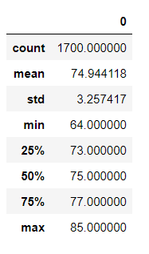
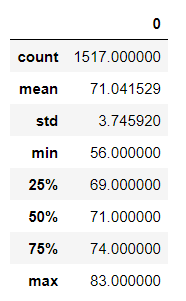
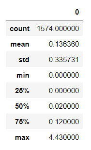
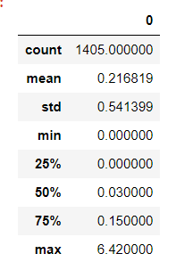

# surfs_up
## Overview

This report is intended to inform an analysis of the year-round sustainability of the surf and ice cream shop business in Oahu. Specifically, the report centers on a comparison of temperatures in the months of June and December.

## Results

1 - The distribution of temperatures in June and December are very similar, as shown in the images below. The mean temperature in December is only 4 degress lower than the mean temperature in June.

 
 

2 - The maximum temperature in December is 2 degress lower than the maximum temperature in June.

3 - The minimum temperature in December is 8 degrees lower than the minimum temperature in June.

## Summary

Although temperature is an important consideration in the best location, precipitation is also crucial. The images below compare the distribution of precipitation in June and December. The mean, max, second and third quartiles are higher in December than in June.

 
 

Further investigation into precipitation, such as number of rainy days vs. sunny days, would be helpful in understanding the impact of precipitation on the business.